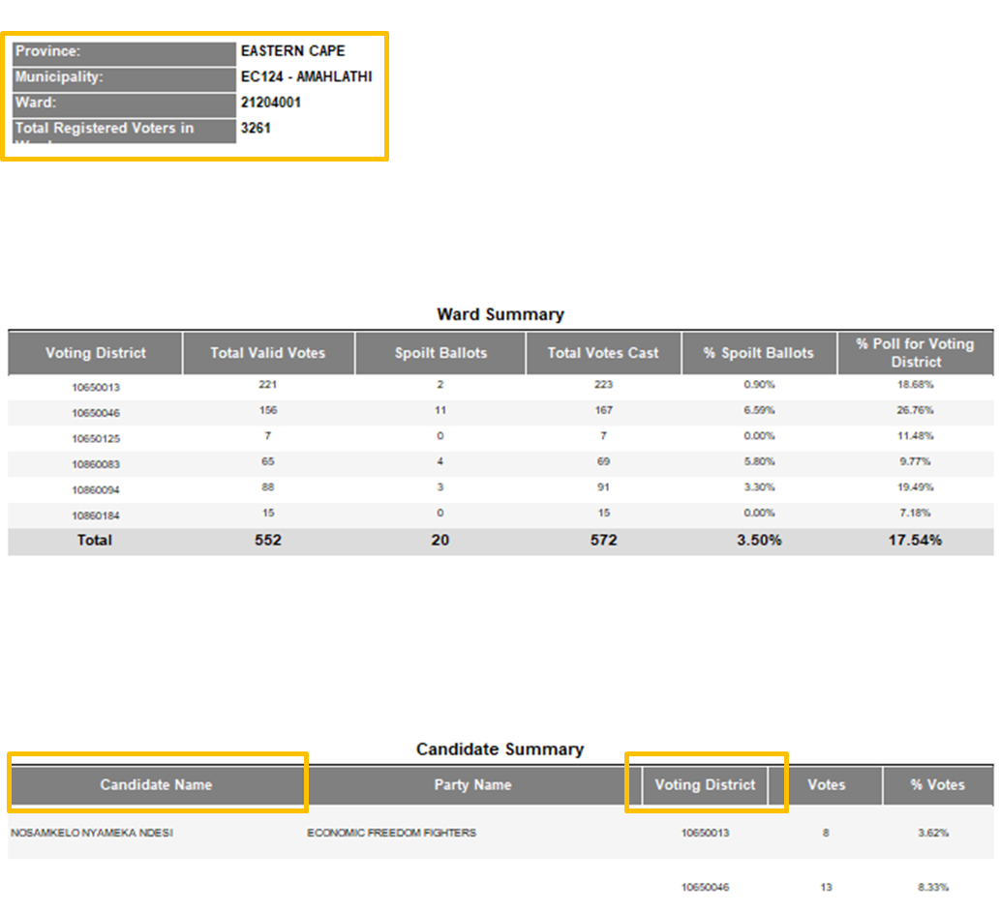
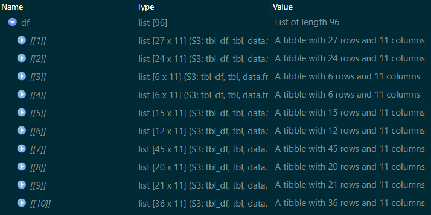

The Data is in the Details
================
05/03/2021

## Mission Impossible?

I want to analyse data from a recent by-election that took place on 11
November 2020, in 95 municipal wards across South Africa. Unfortunately
for me, the IEC [provides the raw
data](https://www.elections.org.za/content/Elections/Municipal-by-elections-results/)
for results of each ward’s by-election in a single `.xls` file
containing both the ward details and the results in human-readable
format. Each file must be manually downloaded (Hint: remember this fact
for later). When we open the downloaded files we see that each file
contains numerous blank rows, merged rows, merged columns, and cells
that are actually variable names in rows other than the first. This
formatting prevents me from simply using the `read*` functions in `R`.

``` r
dplyr::glimpse(readxl::read_xls(here::here("data/ward_results/output (1).xls")))
```

    ## Rows: 89
    ## Columns: 29
    ## $ ...1                   <chr> NA, NA, NA, NA, NA, NA, NA, NA, NA, NA, NA, ...
    ## $ ...2                   <chr> NA, NA, NA, NA, NA, NA, NA, NA, "Province:",...
    ## $ ...3                   <lgl> NA, NA, NA, NA, NA, NA, NA, NA, NA, NA, NA, ...
    ## $ `Electoral Commission` <chr> NA, "BY-ELECTIONS 11 Nov 2020 RESULTS REPORT...
    ## $ ...5                   <chr> NA, NA, NA, "Results as on: 2020/12/06 2:12:...
    ## $ ...6                   <lgl> NA, NA, NA, NA, NA, NA, NA, NA, NA, NA, NA, ...
    ## $ ...7                   <chr> NA, NA, NA, NA, NA, NA, NA, NA, NA, NA, NA, ...
    ## $ ...8                   <chr> NA, NA, NA, NA, NA, NA, NA, NA, "EASTERN CAP...
    ## $ ...9                   <chr> NA, NA, NA, NA, NA, NA, NA, NA, NA, NA, NA, ...
    ## $ ...10                  <lgl> NA, NA, NA, NA, NA, NA, NA, NA, NA, NA, NA, ...
    ## $ ...11                  <chr> NA, NA, NA, NA, NA, NA, NA, NA, NA, NA, NA, ...
    ## $ ...12                  <chr> NA, NA, NA, NA, NA, NA, NA, NA, NA, NA, NA, ...
    ## $ ...13                  <lgl> NA, NA, NA, NA, NA, NA, NA, NA, NA, NA, NA, ...
    ## $ ...14                  <chr> NA, NA, NA, NA, NA, NA, NA, NA, NA, NA, NA, ...
    ## $ ...15                  <chr> NA, NA, NA, NA, NA, NA, NA, NA, NA, NA, NA, ...
    ## $ ...16                  <lgl> NA, NA, NA, NA, NA, NA, NA, NA, NA, NA, NA, ...
    ## $ ...17                  <chr> NA, NA, NA, NA, NA, NA, NA, NA, NA, NA, NA, ...
    ## $ ...18                  <chr> NA, NA, NA, NA, NA, NA, NA, NA, NA, NA, NA, ...
    ## $ ...19                  <chr> NA, NA, NA, NA, NA, NA, NA, NA, NA, NA, NA, ...
    ## $ ...20                  <dbl> NA, NA, NA, NA, NA, NA, NA, NA, NA, NA, NA, ...
    ## $ ...21                  <lgl> NA, NA, NA, NA, NA, NA, NA, NA, NA, NA, NA, ...
    ## $ ...22                  <lgl> NA, NA, NA, NA, NA, NA, NA, NA, NA, NA, NA, ...
    ## $ ...23                  <lgl> NA, NA, NA, NA, NA, NA, NA, NA, NA, NA, NA, ...
    ## $ ...24                  <chr> NA, NA, NA, NA, NA, NA, NA, NA, NA, NA, NA, ...
    ## $ ...25                  <lgl> NA, NA, NA, NA, NA, NA, NA, NA, NA, NA, NA, ...
    ## $ ...26                  <chr> NA, NA, NA, NA, NA, NA, NA, NA, NA, NA, NA, ...
    ## $ ...27                  <chr> NA, NA, NA, NA, NA, NA, NA, NA, NA, NA, NA, ...
    ## $ ...28                  <chr> NA, NA, NA, NA, NA, NA, NA, NA, NA, NA, NA, ...
    ## $ ...29                  <chr> NA, NA, NA, NA, NA, NA, NA, NA, NA, NA, NA, ...

As you can see, a straight import of the file into `R` results in a
jumble of strangely-named, mostly `NA` variables with one or two
information values scattered throughout the rows. But that’s not all!
The ‘best part’ is that the rows containing the desired information
change between files depending on the characteristics of the ward that
it is describing *e.g.* different numbers of voting districts or
candidates up for election *etc*. The silver lining here is that
`read_xls` **does read the file with no errors**. This gives us a
starting point and something to work with.

## The Plan

I want to import the results contained in each of the 95 `.xls` files
into `R`. In my former life, I would have considered capturing the data
manually. Now that I have limited time (and more wisdom), I will just
write a function that takes the chaos of each file, processes it and
presents me with a complete, tidy dataframe/tibble.

### Step 1: Eyeball the Spreadsheets

Before I can piece together my fucntion, I need to know if there is a
reliable structure in each of the 95 spreadsheets for me to hook my
function into. It turns out that even though the files have lots of
white-space as well as different row layouts, there is consistency in
the naming of each section.



The first orange square highlights the ward metadata, database
identifier and total registered voters at the time of the election. This
section begins at the cell labelled `"Province:"`. The second orange
square indicates where the actual vote results begin. This section is
laid out in table format from the heading `"Candidate Name"`. We see
here that each candidate’s name is used just once in the table so the
data is not tidy and we will have to come back to this after import. The
third square indicates that the variable voting district is included in
this table and is repeated for each candidate in the ward. In other
words this section contains the raw data at the finest grain possible.

### Step 2: Extract the Indices

``` r
library(tidyverse)
library(readxl)
library(janitor)
library(here)
library(gt)
```

With the ability to read the file into `R` and knowledge of the files’
structural consistency, we can now extract the row indices of the cell
containing `"Province:"` and `"Candidate Name"`. From the `glimpse`
above we see that `"Province:"` is in the second variable. The code
below imports the file, ascertains `which` row contains `"Province:"`,
`"Candidate Name"` and also `"By-Election Ward Winner"`. From the code
you might correctly guess that this is the label of the last row in each
table of vote results. We don’t need this line, as it is a derived
value, so we subtract the index of the starting row (`- i`) to obtain
`n-max` as the number of rows to read in after the start row.

``` r
dummy <- read_xls(here("data/ward_results/output (1).xls"))
j <- which(dummy[,2] == "Province:")
i <- min(which(dummy[,1] == "Candidate Name"))
n_max <- which(dummy[,1] == "By-Election Ward Winner") - i
```

### Step 3: Capture the Ward Details

Next we want to extract the ward details into a table. Using `j` from
above, we `slice` the original tibble and keep just the two columns we
want.

``` r
dummy2 <- slice(dummy, j:(j + 3)) %>%
          select(detail = ...2,
                 value = ...8)
```

Next we build a tibble containing these details. There are two extra
things we can do now. The first is that we add the date of the
by-election, because while most of the ward details will probably not
change over time, the number of `registered_voters` almost certainly
will! The second is to separate the `municipality` variable into each of
its two components - the abbreviation of the municipality name
(`mun_abbrev`) and the full name (`mun_name`).

``` r
details <- tibble(date = "11 November 2020",
                      province = dummy2$value[1],
                      municipality = dummy2$value[2],
                      ward_id = dummy2$value[3],
                      registered_voters = dummy2$value[4]) %>%
           separate(municipality,
                    into = c("mun_abbrev", "mun_name"),
                    sep = " - ",
                    remove = TRUE)
details %>% gt() %>% tab_options(table.font.size = 11)
```
<div id="romiidbood" style="overflow-x:auto;overflow-y:auto;width:auto;height:auto;"><table class="gt_table">
  
  <thead class="gt_col_headings">
    <tr>
      <th class="gt_col_heading gt_columns_bottom_border gt_left" rowspan="1" colspan="1">date</th>
      <th class="gt_col_heading gt_columns_bottom_border gt_left" rowspan="1" colspan="1">province</th>
      <th class="gt_col_heading gt_columns_bottom_border gt_left" rowspan="1" colspan="1">mun_abbrev</th>
      <th class="gt_col_heading gt_columns_bottom_border gt_left" rowspan="1" colspan="1">mun_name</th>
      <th class="gt_col_heading gt_columns_bottom_border gt_left" rowspan="1" colspan="1">ward_id</th>
      <th class="gt_col_heading gt_columns_bottom_border gt_left" rowspan="1" colspan="1">registered_voters</th>
    </tr>
  </thead>
  <tbody class="gt_table_body">
    <tr>
      <td class="gt_row gt_left">11 November 2020</td>
      <td class="gt_row gt_left">EASTERN CAPE</td>
      <td class="gt_row gt_left">EC124</td>
      <td class="gt_row gt_left">AMAHLATHI</td>
      <td class="gt_row gt_left">21204001</td>
      <td class="gt_row gt_left">3261</td>
    </tr>
  </tbody>
  
  
</table></div>

### Step 4: Capture the Vote Results

The next step is to create a file with the data of the vote results for
each candidate. The solution I settled on was to use `i` and `n_max` to
re-import the result rows from the same `.xls` file that generated them.
The benefit of this approach is that the imported tibble will us the
table headings in the `.xls` file as the variable names. The code below
imports the results to an object named `data`, filters out rows
containing only `NA` values using the new `if_any` function from `dplyr`
v1.04, removes all `NA` columns, and then renames the two variables
where the names were not correctly specified during import.

``` r
data <- read_xls(here("data/ward_results/output (1).xls"),
                 skip = i,
                 n_max = n_max - 1) %>%
        filter(if_any(everything(), ~!is.na(.x))) %>% 
        select(!where(is.logical)) %>%
        rename(vd_votes = ...20,
               vd_percent = ...29) %>%
        clean_names()
head(data) %>% gt() %>% tab_options(table.font.size = 11)
```
<div id="xxqzkugzag" style="overflow-x:auto;overflow-y:auto;width:auto;height:auto;"><table class="gt_table">
  
  <thead class="gt_col_headings">
    <tr>
      <th class="gt_col_heading gt_columns_bottom_border gt_left" rowspan="1" colspan="1">candidate_name</th>
      <th class="gt_col_heading gt_columns_bottom_border gt_left" rowspan="1" colspan="1">party_name</th>
      <th class="gt_col_heading gt_columns_bottom_border gt_left" rowspan="1" colspan="1">voting_district</th>
      <th class="gt_col_heading gt_columns_bottom_border gt_right" rowspan="1" colspan="1">vd_votes</th>
      <th class="gt_col_heading gt_columns_bottom_border gt_left" rowspan="1" colspan="1">vd_percent</th>
    </tr>
  </thead>
  <tbody class="gt_table_body">
    <tr>
      <td class="gt_row gt_left">NOSAMKELO NYAMEKA NDESI</td>
      <td class="gt_row gt_left">ECONOMIC FREEDOM FIGHTERS</td>
      <td class="gt_row gt_left">10650013</td>
      <td class="gt_row gt_right">NA</td>
      <td class="gt_row gt_left">3.62%</td>
    </tr>
    <tr>
      <td class="gt_row gt_left">NA</td>
      <td class="gt_row gt_left">NA</td>
      <td class="gt_row gt_left">NA</td>
      <td class="gt_row gt_right">8</td>
      <td class="gt_row gt_left">NA</td>
    </tr>
    <tr>
      <td class="gt_row gt_left">NA</td>
      <td class="gt_row gt_left">NA</td>
      <td class="gt_row gt_left">10650046</td>
      <td class="gt_row gt_right">NA</td>
      <td class="gt_row gt_left">8.33%</td>
    </tr>
    <tr>
      <td class="gt_row gt_left">NA</td>
      <td class="gt_row gt_left">NA</td>
      <td class="gt_row gt_left">NA</td>
      <td class="gt_row gt_right">13</td>
      <td class="gt_row gt_left">NA</td>
    </tr>
    <tr>
      <td class="gt_row gt_left">NA</td>
      <td class="gt_row gt_left">NA</td>
      <td class="gt_row gt_left">10650125</td>
      <td class="gt_row gt_right">NA</td>
      <td class="gt_row gt_left">0.00%</td>
    </tr>
    <tr>
      <td class="gt_row gt_left">NA</td>
      <td class="gt_row gt_left">NA</td>
      <td class="gt_row gt_left">NA</td>
      <td class="gt_row gt_right">0</td>
      <td class="gt_row gt_left">NA</td>
    </tr>
  </tbody>
  
  
</table></div>

The next small issue is that each candidate has a row containing their
`Total` votes across all `voting_district`s. We don’t need this as we
can derive it as needed, so we `slice` the `data` to remove each
instance of a `Total` row.

``` r
x <- which(data$voting_district == "Total")
data <- slice(data, -x)
```

This is looking good, but we still have to deal with the `NA` values
interspersed throughout the rows. For simplicity, I decided to `pull`
each variable to a vector object and use `drop_na`.

``` r
candidate_name <- data %>% select(candidate_name) %>% drop_na() %>% pull()
party_name <- data %>% select(party_name) %>% drop_na() %>%  pull()
voting_district <- data %>% select(voting_district) %>% drop_na() %>% pull()
vd_votes <- data  %>% select(vd_votes) %>% drop_na() %>% pull()
vd_percent <- data %>% select(vd_percent) %>% drop_na() %>% pull() %>% str_replace_all("%","")
```

### Merge the two tibbles

We’re almost there, but we have to deal with the issue I mentioned right
at the start - each candidate’s name only appears once in the results
table. We need each `candidate_name` to appear in each row of
`voting_district` results. The code below identifies the number of
voting districts in the ward, which we will then use to build the final
tibble.

``` r
rep <- dim(data %>%
       filter(is.na(voting_district) == FALSE) %>%
       distinct(voting_district))[1]
```

At last we can put all the data together in a single tibble! The only
thing worth noting here is the vectorised nature of `R`. We are
combining vectors of `length = >1` from `data` with vectors of
`length = 1` from `details`. This is fine because the `length = 1`
vectors are simply repeated for each row of the tibble. We also use
`str_to_title` to convert each character vector from upper case to title
style (first letter of each word capitalised).

``` r
final_data <- tibble(
    date = details$date,
    province = str_to_title(details$province),
    mun_name = str_to_title(details$mun_name),
    mun_abbrev = details$mun_abbrev,
    ward_id = details$ward_id,
    candidate_name = str_to_title(rep(candidate_name, each = rep)),
    party_name = str_to_title(rep(party_name, each = rep)),
    voting_district = voting_district,
    vd_votes = vd_votes,
    vd_percent = vd_percent,
    total_registered_voters = details$registered_voters)

head(final_data) %>% gt() %>% tab_options(table.font.size = 11)
```

## Completing the Mission

We now have a complete, tidy tibble of all the information we want.

**!! MISSION ACCOMPLISHED !!**

… actually not yet…

I set out to write a function that will import **ALL THE FILES** and
process them. We need to take the code above which is essentially an `R`
script and make it a function. Thankfully, this is not too difficult.

The final version of the function is shown below. If you are not
familiar with writing your own functions, you can skip to the bottom to
continue reading about how to convert the script to the function.

``` r
read_iec_ber <- function(file, 
                        details_start = "Province:", 
                        result_start = "Candidate Name",
                        result_end = "By-Election Ward Winner",
                        date = "11 November 2020"){

    # Specify the packages required in our function code:

    require(readxl)
    require(dplyr)
    require(stringr)
    require(tidyr)
    require(janitor)
    require(readr)
    require(here)

    # Use a dummy file read to extract the municipal info and obtain key 
    # array indices for the actual data import

    dummy <- read_xls(file)
    j<-which(dummy[,2] == details_start)
    dummy2 <- slice(dummy, j:(j+3)) %>%
      select(detail = ...2,
             value = ...8)

    # Create a tibble of the municipal and ward details

    details <- tibble(date = date,
                      province = dummy2$value[1],
                      municipality = dummy2$value[2],
                      ward_id = dummy2$value[3],
                      registered_voters = dummy2$value[4]) %>%
               separate(municipality,
                        into = c("mun_abbrev", "mun_name"),
                        sep = " - ",
                        remove = TRUE)

    # Indices of the start and end rows which bound the voting data

    i <- min(which(dummy[,1] == result_start))
    n_max <- which(dummy[,1] == result_end) - i

    # Use the above row indices to read in the ward vote results

    data <- read_xls(file,
                     skip = i,
                     n_max = n_max - 1) %>%
            filter(if_any(everything(),
                          ~ !is.na(.x))) %>%
            select(!where(is.logical)) %>%
            rename(vd_votes = ...20,
                   vd_percent = ...29) %>%
            clean_names()

    # Remove the rows containing subtotals for each voting district

    x <- which(data$voting_district == "Total")
    data <- slice(data, -x)

    # Create individual vectors with their specific NAs removed

    candidate_name <- data %>% select(candidate_name) %>% drop_na() %>% pull()
    party_name <- data %>% select(party_name) %>% drop_na() %>%  pull()
    voting_district <- data %>% select(voting_district) %>% drop_na() %>% pull()
    vd_votes <- data  %>% select(vd_votes) %>% drop_na() %>% pull()
    vd_percent <- data %>% select(vd_percent) %>% drop_na() %>% pull() %>% str_replace_all("%","")

    # Determine the number of times that the candidate name and party name must be repeated
    # in order to make the data tidy when we build the complete tibble

    rep <- dim(data %>%
           filter(is.na(voting_district) == FALSE) %>%
           distinct(voting_district))[1]

    # Create the complete tidy tibble

    final_data <- tibble(
      date = details$date,
      province = details$province,
      mun_name = details$mun_name,
      mun_abbrev = details$mun_abbrev,
      ward_id = details$ward_id,
      candidate_name = rep(candidate_name, each = rep),
      party_name = rep(party_name, each = rep),
      voting_district = voting_district,
      vd_votes = vd_votes,
      vd_percent = vd_percent,
      total_registered_voters = details$registered_voters)

    # Write the tibble to the disk with the ward number as its name i.e. "{ward_id}.xls"

    file_name <- paste0(c(here::here("data/tidy/"), "/", details$ward_id[1],".csv"), collapse = "")
    write_csv(final_data, file_name, append = FALSE)
}
```

### “I’m Calling It!”

To use the function, we need simply need to provide a filepath or list
of filepaths to the function. The code below generates the list of
filepaths for the 96 `.xls` files in the relevant folder.

``` r
file_list <- list.files(path = here::here("data/ward_results"), pattern = "xls$")
```

Finally, because it is a list, we use `lapply` to run the function for
each file in the list. If you look at the empty folder found at
`../super_wednesday/data/tidy` while the function runs, you can watch
the files being written to the folder.

``` r
df <- lapply(file.path(here::here("data/ward_results"), file_list), read_iec_ber)
```



The `df` object is a list with the data from each of the 96 files… Wait…
there were only 95 wards in the by-election so we must have a duplicated
file somewhere. I must have downloaded two results files for one of the
wards and then Windows simply assigned it to an unused `output (x).xls`
path. I don’t want to open each file and try and figure out which ward
is duplicated, so instead I will use the `anyDuplicated` function (which
I learned about when this actually did happen in my workflow). The code
below shows us that `output (65).xls` is a duplicated file and can be
deleted.

(Sidenote: The benefit of writing files using the `ward_id` variable for
the name is that I only wrote 95 unique files to disk. The duplicate
simply overwrote the original.)

``` r
file_list[anyDuplicated(df)]
```

    ## [1] "output (65).xls"

Now it really is:

**!! MISSION ACCOMPLISHED !!**

Thank you for reading.

I hope this post has helped you to see silver linings and possibilities
when confronted by data in human-friendly presentation formats.

Happy coding!

### Appendix: Converting Scripts to Functions

**Quick reminder:**  
A function has a `name`, `arguments` and `code`. The code below shows
how they fit together. The `function` call is used to tell `R` that we
are creating an object called `name` which is a function. The
`argument`s indicate those data which the user must specify, unless they
have a default value specified. If a default value is specified, the
`argument` can be left out when the function is called.

``` r
<NAME> <- function(argument1,
                   argmuent2, 
                   argument3 = <DEFAULT VALUE>){
  
      <THE FUNCTION CODE GOES HERE>
  
      }
```

For my function the code looks like this:

``` r
read_iec_ber <- function(file, 
                        details_start = "Province:", 
                        result_start = "Candidate Name",
                        result_end = "By-Election Ward Winner",
                        date = "11 November 2020"){
      
        <MY AWESOME CODE>
    
      }
```

The function is called `read_iec_ber` (where the “ber” stands for
by-election). The `arguments` are:  
- `file`: a path to the file that the function will process, -
`details_start`: a character string indicating starting row of the ward
details in the file, - `results_start`: a character string indicating
the starting row of the results table in the file, - `results_end`: a
character string indicating the end row of the results table in the
file, - `date`: the date of the by-election that the file is from.

For each `argument` other than `file`, I specified a default value.
These values may need to be changed in future by-elections but it
simplifies the function call in this case.

The first section of function code simply specifies the packages that
the function needs to expect to use functions from.

``` r
 # Specify the packages required in our function code:

    require(readxl)
    require(dplyr)
    require(stringr)
    require(tidyr)
    require(janitor)
    require(readr)
    require(here)
```

The main chunk of the code comes directly from the script shown in each
stage in the main post.

``` r
# Use a dummy file read to extract the municipal info and obtain key 
    # array indices for the actual data import

    dummy <- read_xls(file)
    j<-which(dummy[,2] == details_start)
    dummy2 <- slice(dummy, j:(j+3)) %>%
      select(detail = ...2,
             value = ...8) %>% 
      mutate(detail = str_replace_all(dummy2$detail, ":", ""))

    # Create a tibble of the municipal and ward details

    details <- tibble(date = date,
                      province = dummy2$value[1],
                      municipality = dummy2$value[2],
                      ward_id = dummy2$value[3],
                      registered_voters = dummy2$value[4]) %>%
               separate(municipality,
                        into = c("mun_abbrev", "mun_name"),
                        sep = " - ",
                        remove = TRUE)

    # Indices of the start and end rows which bound the voting data

    i <- min(which(dummy[,1] == result_start))
    n_max <- which(dummy[,1] == result_end) - i

    # Use the above row indices to read in the ward vote results

    data <- read_xls(file,
                     skip = i,
                     n_max = n_max - 1) %>%
            filter(if_any(everything(),
                          ~ !is.na(.x))) %>%
            select(!where(is.logical)) %>%
            rename(vd_votes = ...20,
                   vd_percent = ...29) %>%
            clean_names()

    # Remove the rows containing subtotals for each voting district

    x <- which(data$voting_district == "Total")
    data <- slice(data, -x)

    # Create individual vectors with their specific NAs removed

    candidate_name <- data %>% select(candidate_name) %>% drop_na() %>% pull()
    party_name <- data %>% select(party_name) %>% drop_na() %>%  pull()
    voting_district <- data %>% select(voting_district) %>% drop_na() %>% pull()
    vd_votes <- data  %>% select(vd_votes) %>% drop_na() %>% pull()
    vd_percent <- data %>% select(vd_percent) %>% drop_na() %>% pull() %>% str_replace_all("%","")

    # Determine the number of times that the candidate name and party name must be repeated
    # in order to make the data tidy when we build the complete tibble

    rep <- dim(data %>%
           filter(is.na(voting_district) == FALSE) %>%
           distinct(voting_district))[1]

    # Create the complete tidy tibble

    final_data <- tibble(
      date = details$date,
      province = details$province,
      mun_name = details$mun_name,
      mun_abbrev = details$mun_abbrev,
      ward_id = details$ward_id,
      candidate_name = rep(candidate_name, each = rep),
      party_name = rep(party_name, each = rep),
      voting_district = voting_district,
      vd_votes = vd_votes,
      vd_percent = vd_percent,
      total_registered_voters = details$registered_voters)
```

The last section takes the data and writes it to a uniquely named `.csv`
file which can be imported with any appropriate `read*` function. In
this iteration, the written file uses the `ward_id` number as its name.
I expect that I will add the by-election `date` to each file in the
future.

``` r
# Write the tibble to the disk with the ward number as its name i.e. "{ward_id}.xls"

file_name <- paste0(c(here::here("data/tidy/"), "/", details$ward_id[1],".csv"), collapse = "")
write_csv(final_data, file_name, append = FALSE)
```
